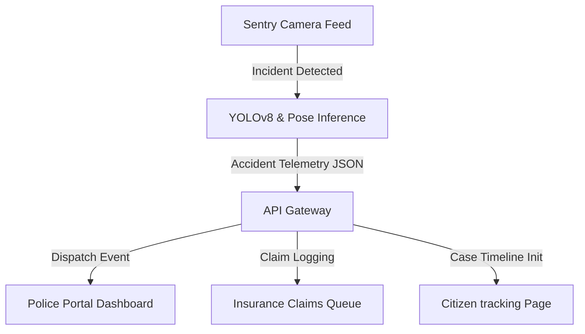

# Sentry Architecture Design

Sentry is structured as a modular single-page React application, designed to bridge automated AI alerts with human workflows.

## Design Principles

1.  **Strict Decoupling**: View components are completely decoupled from the data layer. Pages interact only with services, allowing backend integration by modifying only the services.
2.  **Role-Based Separation**: The application enforces clear boundaries between police, insurance, and victim views, governed by a centralized session state.
3.  **Performant Bundling**: Leverages Vite for bundling with lazy loading for all page views, keeping the initial JS load small.
4.  **No Utility CSS Frameworks**: Custom vanilla CSS design tokens prevent dependency bloat, ensuring maximum compatibility and consistent accessibility styling.

## Telemetry Pipeline

## Data Management

All data is partitioned:
*   `src/data/users.js`: User profiles and jurisdictions.
*   `src/data/police.js`: Telemetry records, vehicles, and casualty reports.
*   `src/data/insurance.js`: Compensation requests and adjuster audits.
*   `src/data/victim.js`: Appeals and citizen-filed disputes.
